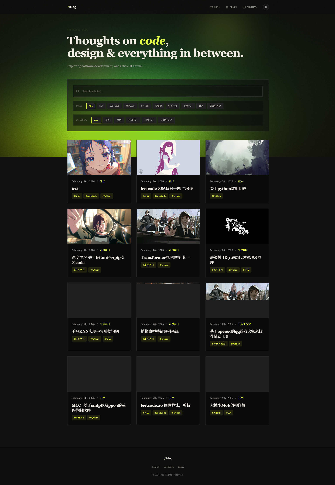
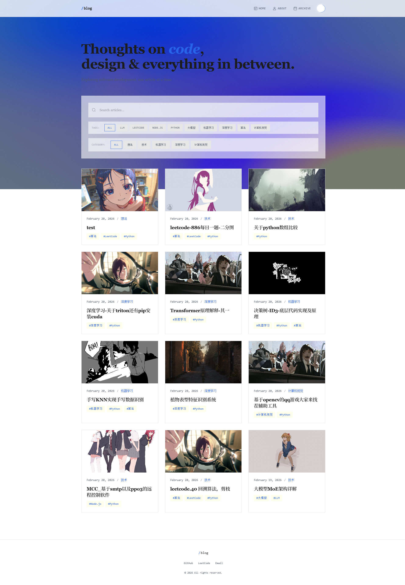
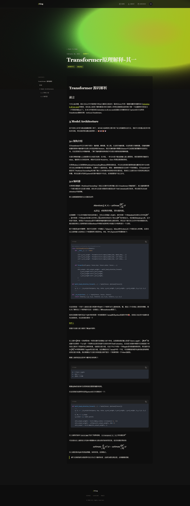
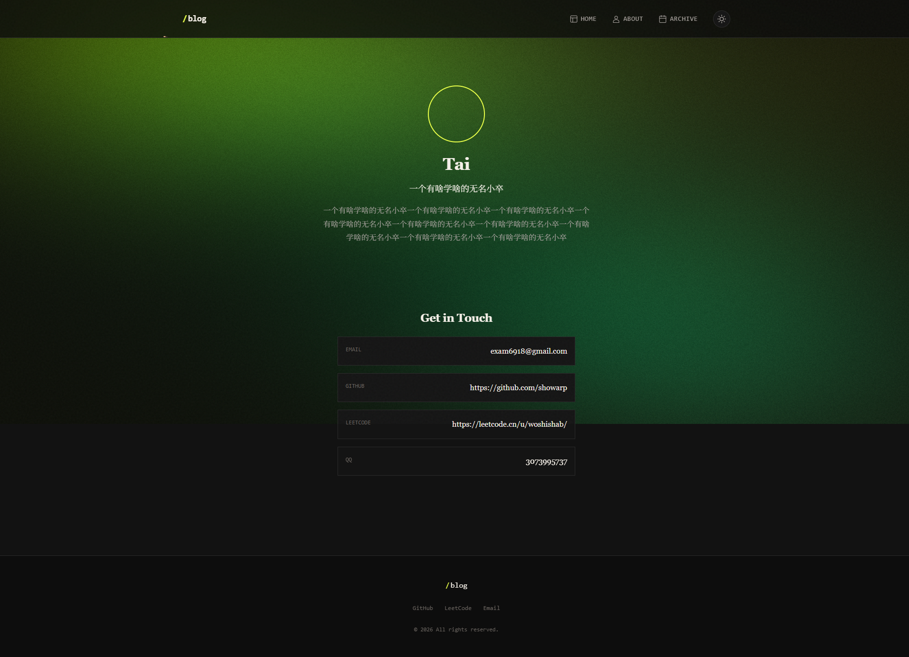
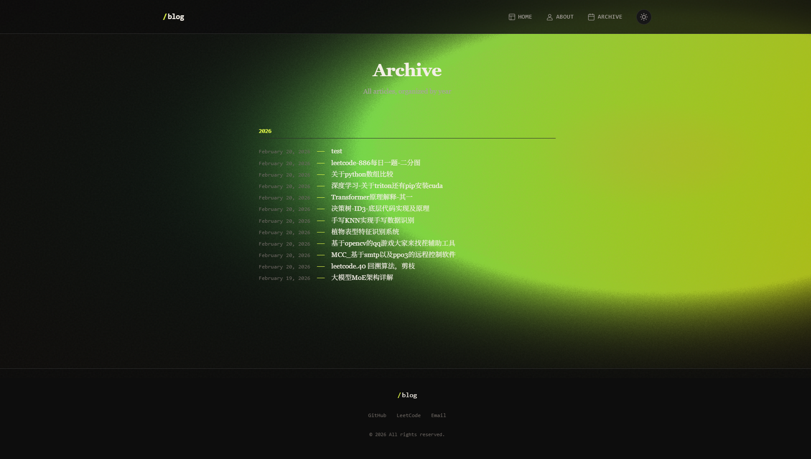
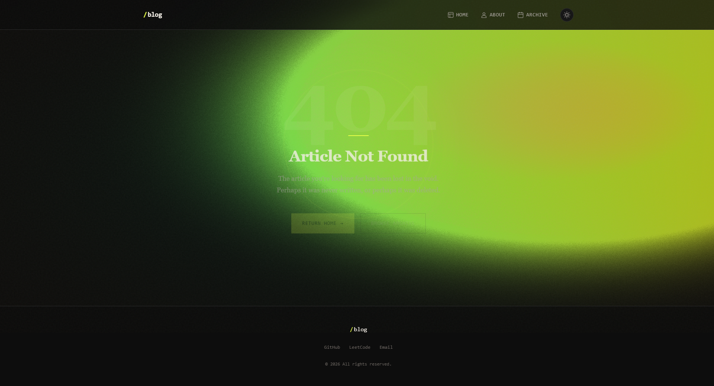

# Blog - Next.js + Notion CMS

一个基于 Notion 的内容管理系统构建的技术博客，使用 Next.js 16 和 App Router 构建，部署在 Vercel 上。

博客采用**"编辑风格粗野主义"（Editorial Brutalist）**设计美学，具有独特的排版和视觉元素。



## 页面预览

| 首页 (深色主题) | 首页 (浅色主题) |
|----------------|----------------|
|  |  |

| 文章详情页 | 关于页面 |
|----------|---------|
|  |  |

| 归档页面 | 404 页面 |
|---------|---------|
|  |  |

## 在线演示

访问：[https://blog-nine-orcin-81.vercel.app](https://blog-nine-orcin-81.vercel.app)

## 仓库

GitHub: [https://github.com/showarp/blog](https://github.com/showarp/blog)

## 特性

- **Notion CMS** - 使用 Notion 数据库作为内容管理系统，轻松管理文章
- **Next.js 16** - 基于最新的 Next.js 16 和 App Router 构建
- **响应式设计** - 完美支持桌面端和移动端
- **深色/浅色主题** - 支持主题切换，自适应系统偏好
- **高性能** - 静态生成 + 按需服务器渲染，优化的加载性能
- **Markdown 渲染** - 支持 GFM、LaTeX 数学公式、语法高亮
- **Mermaid 图表** - 内置 Mermaid 流程图支持
- **灯箱效果** - 图片点击查看，支持缩放和导航
- **自定义光标** - 独特的光标跟随效果

## 技术栈

| 类别 | 技术 |
|------|------|
| 框架 | Next.js 16 + App Router |
| 语言 | TypeScript, React 19 |
| 样式 | CSS 变量 + 自定义 CSS |
| 内容源 | Notion API (@notionhq/client) |
| Markdown | notion-to-md, react-markdown |
| 数学公式 | KaTeX |
| 图表 | Mermaid |
| 代码高亮 | PrismJS |
| 主题 | next-themes |
| 部署 | Vercel |

## 项目结构

```
blog/
├── app/
│   ├── api/              # API 路由
│   │   ├── posts/        # 获取文章列表
│   │   ├── post/[slug]/  # 获取单篇文章
│   │   ├── about/        # 获取关于信息
│   │   ├── tags/         # 获取所有标签
│   │   └── categories/   # 获取所有分类
│   ├── about/            # 关于页面
│   ├── archive/          # 归档页面
│   ├── post/[slug]/      # 文章详情页
│   ├── layout.tsx        # 根布局
│   ├── page.tsx          # 首页
│   └── globals.css       # 全局样式
├── components/
│   ├── Header.tsx        # 头部导航
│   ├── Footer.tsx        # 页脚
│   ├── ThemeToggle.tsx   # 主题切换
│   ├── CustomCursor.tsx  # 自定义光标
│   └── LiquidGradient.tsx # 背景动效
├── lib/
│   ├── notion.ts         # Notion API 客户端
│   └── utils.ts          # 工具函数
├── types/
│   └── index.ts          # TypeScript 类型定义
├── .env.local            # 环境变量（不提交）
└── next.config.ts        # Next.js 配置
```

## 快速开始

### 环境要求

- Node.js 20+
- npm / yarn / pnpm
- Notion 账户

### 1. 克隆项目

```bash
git clone https://github.com/your-username/your-blog.git
cd your-blog
```

### 2. 安装依赖

```bash
npm install
```

### 3. 配置环境变量

复制 `.env.example` 文件为 `.env.local`：

```bash
cp .env.example .env.local
```

编辑 `.env.local`，填入你的 Notion 配置：

```env
NOTION_TOKEN=your_notion_integration_token
NOTION_DATABASE_ID=your_posts_database_id
NOTION_ABOUT_DATABASE_ID=your_about_database_id
UMAMI_WEBSITE_ID=your_umami_analytics_id
```

### 4. 启动开发服务器

```bash
npm run dev
```

访问 [http://localhost:3000](http://localhost:3000) 查看效果。

## 可用命令

```bash
npm run dev      # 启动开发服务器（Turbopack）
npm run build    # 构建生产版本
npm run start    # 启动生产服务器
npm run lint     # 运行 ESLint 检查
```

## Notion 数据库配置

### 文章数据库 (Posts)

在 Notion 中创建一个数据库，包含以下属性：

| 列名 | 类型 | 说明 |
|------|------|------|
| Name | 标题 | 文章标题 |
| Slug | 文本 | URL 路径 |
| Summary | 文本 | 文章摘要 |
| Cover | 文件和媒体 | 封面图片 |
| Tags | 多选 | 标签 |
| Category | 单选 | 分类：想法、技术、机器学习、深度学习、计算机视觉 |
| Published | 复选框 | 是否发布 |
| Date | 创建时间 | 创建日期 |

### 关于数据库 (About Me)

创建一个单条记录的数据库，包含以下属性：

| 列名 | 类型 | 说明 |
|------|------|------|
| Name | 标题 | 名称 |
| Avatar | 文件和媒体 | 头像 |
| Bio | 文本 | 简短简介 |
| BioExtended | 文本 | 详细简介 |
| Email | 邮箱 | 电子邮件 |
| GitHub | URL | GitHub 链接 |
| Leetcode | URL | LeetCode 链接 |
| QQ | 文本 | QQ 号 |

### 获取 Notion Token 和 Database ID

1. 访问 [Notion Integrations](https://www.notion.so/my-integrations)
2. 创建一个新的 Integration
3. 复制生成的 Token 作为 `NOTION_TOKEN`
4. 打开你的数据库，点击右上角 `···` → `Copy link`
5. 从链接中提取 Database ID（`https://notion.so/your-workspace/`**`database-id`**`?v=...`）
6. 在 Notion 中，将数据库分享给你的 Integration

## 部署到 Vercel

### 方式一：一键部署

[](https://vercel.com/new/clone?repository-url=https://github.com/showarp/blog)

### 方式二：手动部署

1. 安装 Vercel CLI：
   ```bash
   npm install -g vercel
   ```

2. 部署到生产环境：
   ```bash
   vercel --prod
   ```

3. 在 Vercel 控制台配置环境变量：
   - `NOTION_TOKEN`
   - `NOTION_DATABASE_ID`
   - `NOTION_ABOUT_DATABASE_ID`

### 自动部署

连接 GitHub 仓库后，每次 push 到 `main` 分支会自动触发部署。

## 设计系统

博客采用"编辑风格粗野主义"美学：

### 颜色

| 变量 | 暗色主题 | 亮色主题 |
|------|----------|----------|
| `--bg-primary` | `#0a0a0a` | `#ffffff` |
| `--text-primary` | `#f5f0e8` | `#1a1a1a` |
| `--accent` | `#e8ff47` (电 lime 绿) | `#2563eb` (皇家蓝) |

### 字体

- 正文：系统衬线字体
- 代码：等宽字体

### 动效

- 液态渐变背景（Three.js）
- 平滑主题过渡
- 悬停交互效果

## 功能展示

- [x] 文章列表与搜索
- [x] 标签/分类筛选
- [x] 文章归档（按年份）
- [x] Markdown 渲染
- [x] 代码语法高亮
- [x] LaTeX 数学公式
- [x] Mermaid 流程图
- [x] 图片灯箱
- [x] 深色/浅色主题
- [x] 响应式布局
- [x] SEO 优化

## 许可证

MIT License

## 致谢

- [Next.js](https://nextjs.org/)
- [Notion](https://notion.so/)
- [Vercel](https://vercel.com/)
- [notion-to-md](https://github.com/souvikinator/notion-to-md)
